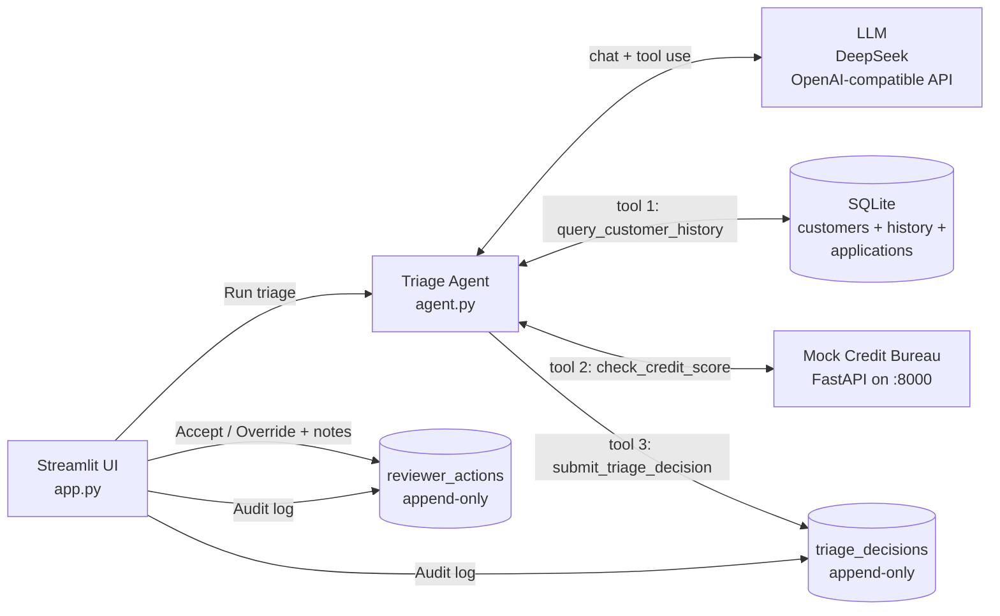

# SME Loan Triage Agent

A working demo of an LLM agent that pre-screens UK SME loan applications, with a
human reviewer staying in the loop. Built as a portfolio piece — opinionated about
governance, audit, and the seam between agent and human.

## The problem

SME loan pre-screening is, at many lenders, still a manual process:

1. Look up the customer's history in the core banking system.
2. Switch to the credit bureau portal, pull the latest score and risk band.
3. Skim past communications for context.
4. Combine all of that into a decision: approve / refer to senior reviewer / decline.

Easy to miss things; hard to audit *why* a decision was made later.

## The solution

The reviewer picks an application from the queue and clicks **Run triage**. An
LLM agent then:

1. Queries the bank's repayment history (SQL).
2. Calls the credit bureau (REST).
3. Returns a structured recommendation — verdict, reasoning, scannable risk
   flags, and key evidence with concrete record IDs the reviewer can re-check.

The reviewer reads it and either **accepts** the agent's recommendation or
**overrides** it with a new decision plus required notes. Both the agent's
decision and the reviewer's response are written to **separate append-only
audit tables**, so the full chain of custody is preserved.

The agent handles evidence-gathering and initial judgment; the human handles
final decisions and edge cases — clean division of labor, with audit trail.

## Architecture



## Tech stack

| Layer | Choice | Why |
|---|---|---|
| LLM | DeepSeek (`deepseek-chat`) via OpenAI SDK | OpenAI-compatible API — client and endpoint are swappable |
| Agent loop | Plain Python, function-calling format | No framework — easier to reason about and audit |
| UI | Streamlit | Fast iteration; live event streaming for transparency |
| Internal DB | SQLite | Self-contained for a demo; replace with Postgres in production |
| External API | FastAPI mock credit bureau | Simulates a real third-party REST integration |

## Quick start

```bash
git clone <this-repo>
cd sme-loan-triage-agent
pip install -r requirements.txt

# Seed the SQLite DB with synthetic customers + history + applications
python seed.py

# Add your LLM key
cp .env.example .env
# then edit .env and set DEEPSEEK_API_KEY=sk-...
```

Run the two services in separate terminals:

```bash
# Terminal 1 — mock credit bureau (port 8000)
python credit_api.py

# Terminal 2 — Streamlit UI (port 8501)
python -m streamlit run app.py
```

On Windows, `start.bat` is a one-click shortcut that opens both terminals for you.

The browser opens at `http://localhost:8501`.

### What you'll see

1. Pick an application from the sidebar and click **Run triage**.
2. The agent's tool calls and results stream into the page in real time as it
   gathers evidence (typically 1–2 turns).
3. The final recommendation appears with reasoning, key evidence, and risk flags.
4. Accept the recommendation, or override it with notes for the audit trail.
5. The audit log at the bottom shows every decision — agent's and reviewer's.

Try **APP001** (strong borrower) for a clean approve, then **APP003** (prior
default, low score) for a clear decline — comparing the two is the quickest way
to see the agent's judgment.

## Project structure

```
sme-loan-triage-agent/
├── app.py            Streamlit UI (reviewer's screen)
├── agent.py          Agent loop + system prompt + tool schemas
├── tools.py          The three agent tools + reviewer audit functions
├── credit_api.py     Mock credit bureau (FastAPI)
├── seed.py           Build bank.db with synthetic data
├── start.bat         One-click launcher (Windows)
├── requirements.txt
└── .env.example
```

## Design decisions worth calling out

**Why three tools, not one.** Each tool has a single, narrow purpose.
`submit_triage_decision` is itself a tool, called exactly once at the end —
this forces the agent to commit to a structured answer rather than free-text
prose, and gives a natural hook for persistence and validation.

**Why two append-only audit tables, not one.** `triage_decisions` records what
the agent recommended; `reviewer_actions` records what the human did about it
(accept or override + notes). Keeping them separate preserves the agent's
decision immutably even when the reviewer disagrees — this is what regulators
mean by "model decision provenance".

**Why `risk_flags` is its own field, not buried in `reasoning`.** A reviewer
scans dozens of these per day; coloured chips beat reading prose. The schema
forces the LLM to enumerate flags discretely, which also makes them queryable
later (e.g. "how often does the agent flag prior defaults?").

**Why `key_evidence` must cite a `record_id`.** "3 of 4 loans were late" is
true but not retraceable. The system prompt and tool schema both require the
LLM to name a concrete identifier (`record_id=18`, `application_id=APP003`,
or the credit bureau's score) for every evidence item. An auditor can then
re-pull the source row.

**Why streaming events out of the agent.** `triage_stream()` is a generator
that yields `turn_start` / `tool_call` / `tool_result` / `final` events. The
UI renders each event as it arrives, so the reviewer sees the agent's
reasoning unfolding in real time — important for trust and debugging.

