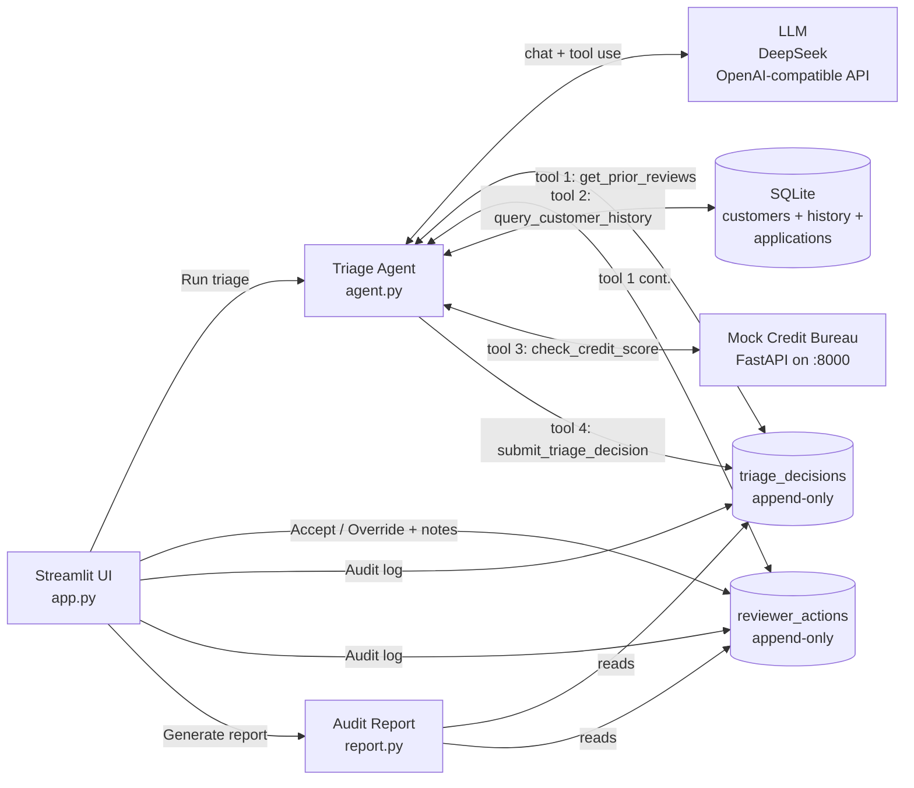

# SME Loan Triage Agent

A working demo of an LLM agent that pre-screens UK SME loan applications, with a
human reviewer staying in the loop. Built as a portfolio piece — opinionated about
governance, audit, and the seam between agent and human.


*The reviewer's working surface: long-term memory (Prior history), agent recommendation (left, cobalt), and human accept / override (right, amber) — one application, one screen.*


## The problem

SME loan pre-screening is, at many lenders, still a manual process:

1. Look up the customer's history in the core banking system.
2. Switch to the credit bureau portal, pull the latest score and risk band.
3. Skim past communications for context.
4. Combine all of that into a decision: approve / refer to senior reviewer / decline.

Easy to miss things; hard to audit *why* a decision was made later.

## The solution

The reviewer picks an application from the queue and clicks **Run triage**. An
LLM agent then:

1. Looks up the customer's **prior triage history at this bank** — past agent
   recommendations and the senior reviewer's response to each (long-term
   memory). If a reviewer has overridden the agent on this customer before,
   that's a strong calibration signal the agent factors into the new decision.
2. Queries the bank's repayment history (SQL).
3. Calls the credit bureau (REST).
4. Returns a structured recommendation — verdict, reasoning, scannable risk
   flags, and key evidence with concrete record IDs the reviewer can re-check.

The reviewer reads it and either **accepts** the agent's recommendation or
**overrides** it with a new decision plus required notes. Both the agent's
decision and the reviewer's response are written to **separate append-only
audit tables**, so the full chain of custody is preserved — and the next time
the same customer applies, the agent sees what happened.

The agent handles evidence-gathering and initial judgment; the human handles
final decisions and edge cases — clean division of labor, with audit trail
and a feedback loop.

## Architecture



## Audit report


*One slide of the generated audit report — a presentation-quality HTML deck (Blue Professional template) the reviewer can preview inline or hand off to the credit committee.*


## Tech stack

| Layer | Choice | Why |
|---|---|---|
| LLM | DeepSeek (`deepseek-chat`) via OpenAI SDK | OpenAI-compatible API — client and endpoint are swappable |
| Agent loop | Plain Python, function-calling format | No framework — easier to reason about and audit |
| UI | Streamlit | Fast iteration; live event streaming for transparency |
| Internal DB | SQLite | Self-contained for a demo; replace with Postgres in production |
| External API | FastAPI mock credit bureau | Simulates a real third-party REST integration |

## Quick start

```bash
git clone <this-repo>
cd sme-loan-triage-agent
pip install -r requirements.txt

# Seed the SQLite DB with synthetic customers + history + applications
python seed.py

# Add your LLM key
cp .env.example .env
# then edit .env and set DEEPSEEK_API_KEY=sk-...
```

Run the two services in separate terminals:

```bash
# Terminal 1 — mock credit bureau (port 8000)
python credit_api.py

# Terminal 2 — Streamlit UI (port 8501)
python -m streamlit run app.py
```

On Windows, `start.bat` is a one-click shortcut that opens both terminals for you.

The browser opens at `http://localhost:8501`.

### What you'll see

1. Pick an application from the sidebar. **Prior history at this bank** shows
   immediately — past triage outcomes for this customer plus how the senior
   reviewer responded.
2. Click **Run triage**. The agent's tool calls + results stream into a
   collapsible trace panel; the agent first consults prior history, then pulls
   internal repayment data and the external credit score.
3. The recommendation appears side-by-side with the reviewer panel: cobalt-
   accented **AI Analyst** on the left (verdict card, risk flags, reasoning,
   key evidence) and amber-accented **Senior Reviewer** on the right (accept
   / override form, or the recorded outcome).
4. Accept the recommendation, or override it with notes for the audit trail.
5. **Generate audit report** — a polished, presentation-quality HTML deck
   styled like a Blue Professional consulting report, suitable for sharing
   with the credit committee. Preview inline or download standalone.
6. The audit log at the bottom shows every decision — agent's and reviewer's.

Try **APP001** (strong borrower) for a clean approve. Then run **APP003**
(prior default, low score), override the agent's recommendation with a
plausible reason, and run APP003 *again* — the agent will see your prior
override in `get_prior_reviews` and recalibrate. This is the long-term-memory
feedback loop in action.

## Project structure

```
sme-loan-triage-agent/
├── app.py                Streamlit UI (reviewer's screen, themed)
├── agent.py              Agent loop + system prompt + tool schemas
├── tools.py              The four agent tools + reviewer audit functions
├── report.py             Audit-report renderer (Blue Professional template)
├── credit_api.py         Mock credit bureau (FastAPI)
├── seed.py               Build bank.db with synthetic data
├── start.bat             One-click launcher (Windows)
├── .streamlit/
│   └── config.toml       Theme palette (mirrors the audit report)
├── templates/
│   ├── blue-professional.html    Source slide template
│   └── blue-professional.json    Template metadata (palette, typography)
├── requirements.txt
└── .env.example
```

## Design decisions worth calling out

**Why four tools, not one.** Each tool has a single, narrow purpose.
`submit_triage_decision` is itself a tool, called exactly once at the end —
this forces the agent to commit to a structured answer rather than free-text
prose, and gives a natural hook for persistence and validation.

**Why two append-only audit tables, not one.** `triage_decisions` records what
the agent recommended; `reviewer_actions` records what the human did about it
(accept or override + notes). Keeping them separate preserves the agent's
decision immutably even when the reviewer disagrees — this is what regulators
mean by "model decision provenance".

**Why `risk_flags` is its own field, not buried in `reasoning`.** A reviewer
scans dozens of these per day; coloured chips beat reading prose. The schema
forces the LLM to enumerate flags discretely, which also makes them queryable
later (e.g. "how often does the agent flag prior defaults?").

**Why `key_evidence` must cite a `record_id`.** "3 of 4 loans were late" is
true but not retraceable. The system prompt and tool schema both require the
LLM to name a concrete identifier (`record_id=18`, `application_id=APP003`,
or the credit bureau's score) for every evidence item. An auditor can then
re-pull the source row.

**Why streaming events out of the agent.** `triage_stream()` is a generator
that yields `turn_start` / `tool_call` / `tool_result` / `final` events. The
UI renders each event as it arrives, so the reviewer sees the agent's
reasoning unfolding in real time — important for trust and debugging. The
trace is also persisted in `session_state` and replayed across reruns, so it
doesn't vanish when the reviewer accepts or overrides.

**Why a long-term memory tool.** `get_prior_reviews` queries the audit tables
for the same customer across all of their past applications, then returns
agent recommendations alongside reviewer accept/override outcomes. The system
prompt makes calling it mandatory step 1 — *before* the agent looks at fresh
data — so the agent's read is conditioned on what the bank actually did last
time. If a senior reviewer previously overrode the agent on this customer,
that's treated as a strong calibration signal, not noise. The result is a
clean human → agent feedback loop without any model fine-tuning.

**Why a separate audit-report module.** `report.py` renders the same triage
data into a presentation-quality HTML deck (Blue Professional template) that
the reviewer can preview inline or download. The interactive Streamlit UI is
for the in-flight decision; the report is the artefact downstream consumers
(credit committee, compliance, regulators) actually look at. Same data, two
different surfaces, each fit for purpose.

**Why the UI uses the same visual language as the report.** `.streamlit/
config.toml` and the CSS injected at the top of `app.py` mirror the report
template's palette and typography (Inter + Space Grotesk, cream + cobalt).
The reviewer's working surface and the deliverable they hand off share one
visual identity — small detail, but it signals product polish rather than
internal-tool aesthetics.

